# 🔥 FLUJOS COMPLETOS DEL SISTEMA HOMECARE

## Modelo inDriver: Ofertas Competitivas

---

## FLUJO 1: Registro y Autenticación

### Cliente - Registro

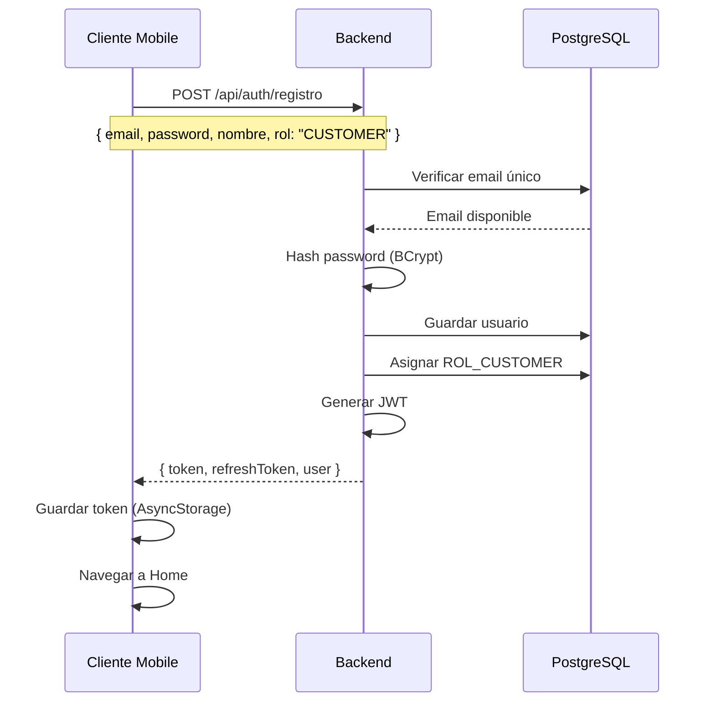

### Proveedor - Registro

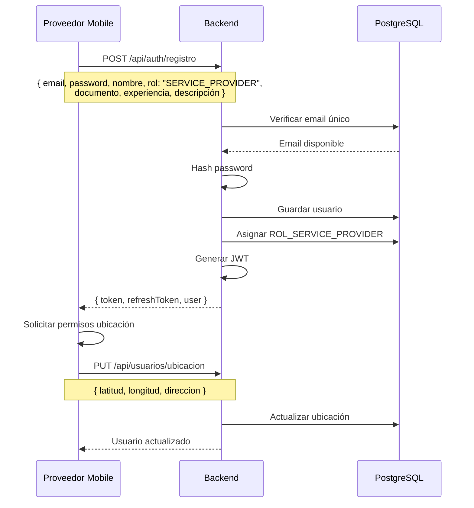

---

## FLUJO 2: Crear Solicitud (Cliente)

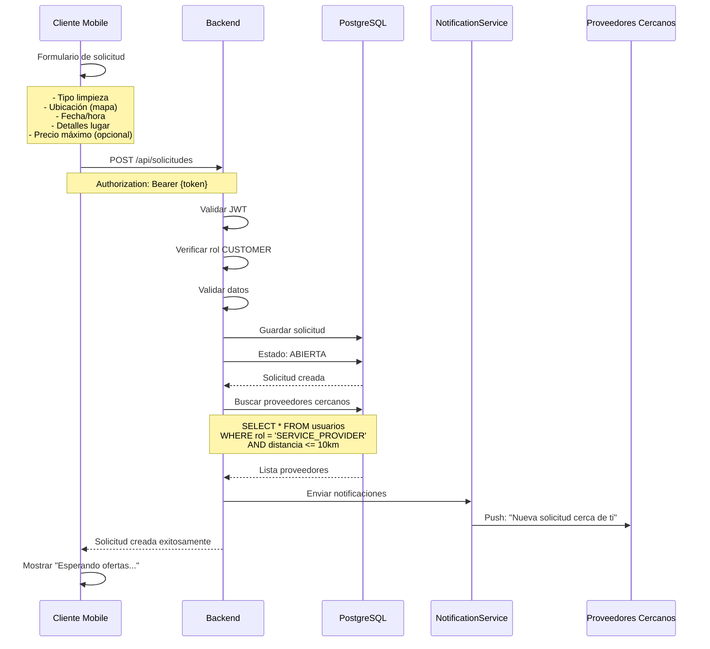

---

## FLUJO 3: Proveedor Ve Solicitudes Cercanas

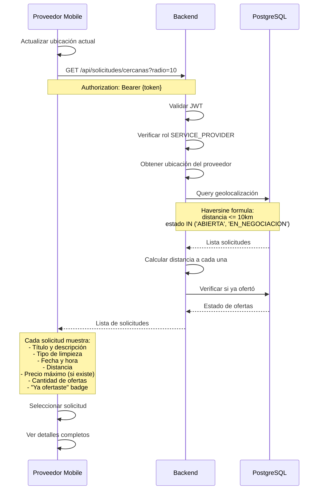

---

## FLUJO 4: Enviar Oferta (Modelo inDriver)

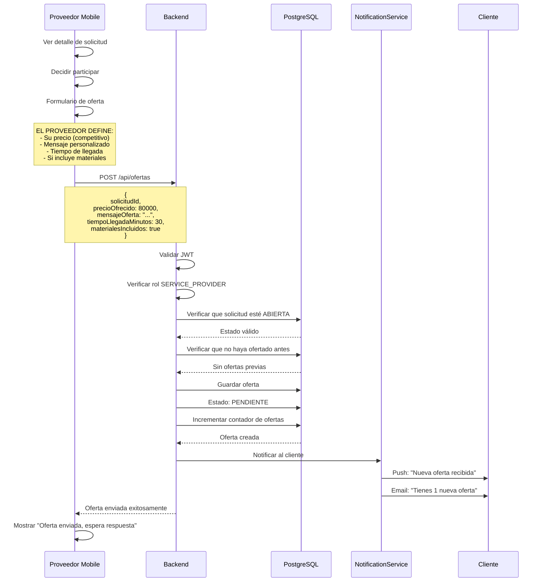

---

## FLUJO 5: Cliente Ve Ofertas (Elección Manual)

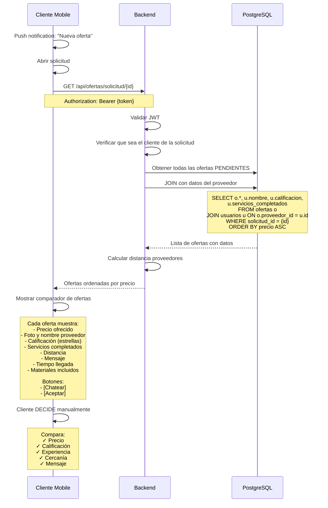

---

## FLUJO 6: Negociación por Chat

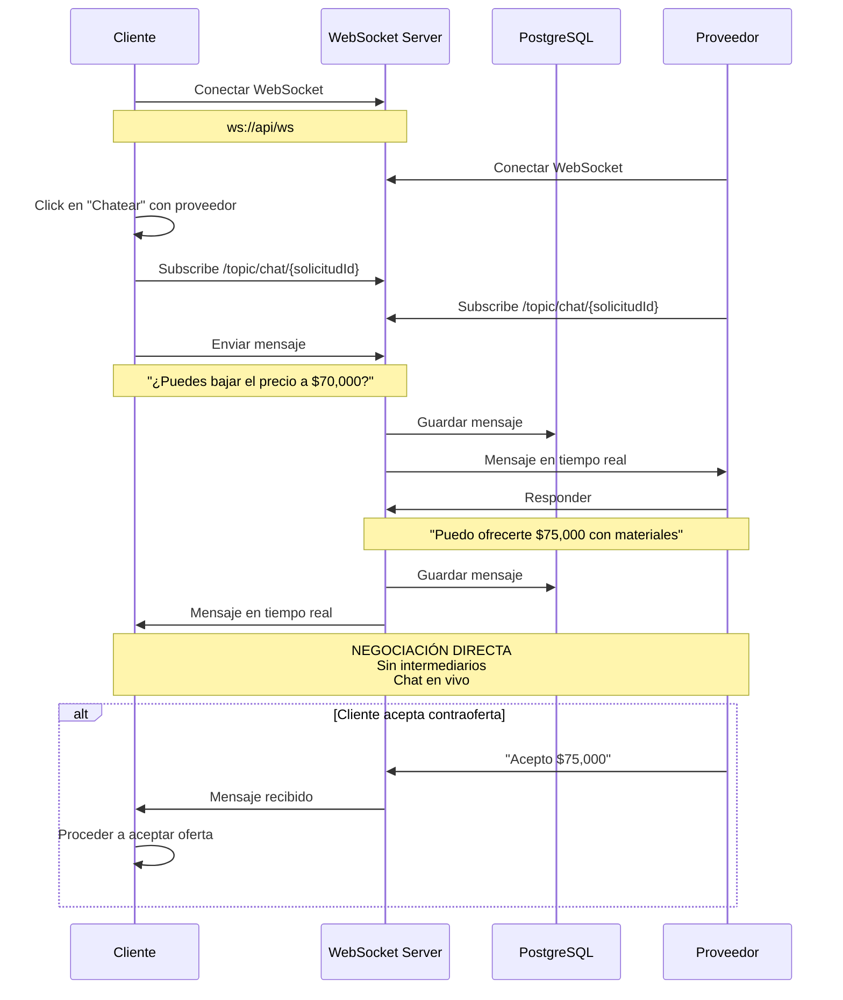

---

## FLUJO 7: Aceptar Oferta (Cliente Elige)

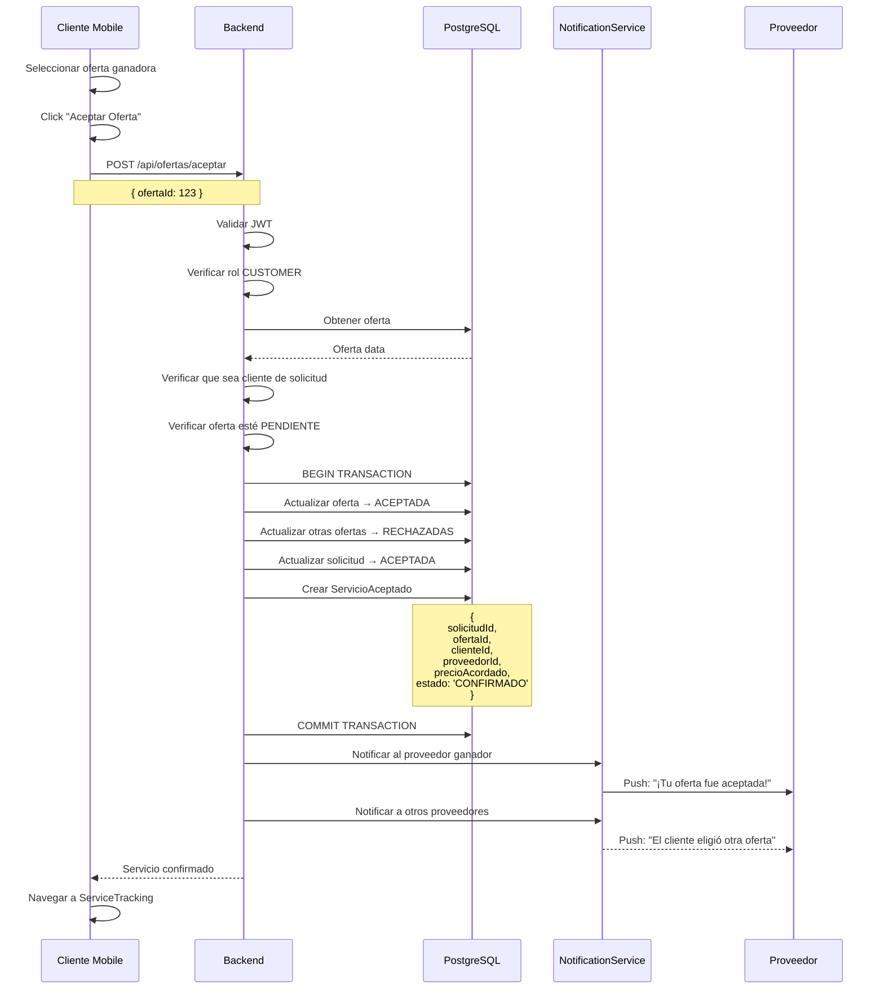

---

## FLUJO 8: Tracking del Servicio

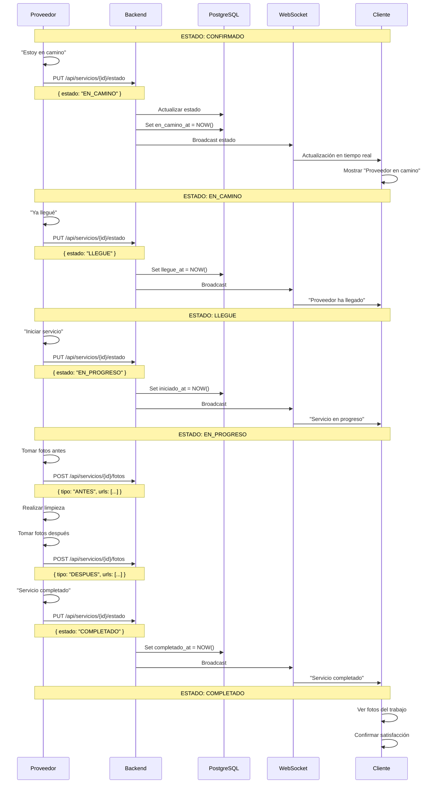

---

## FLUJO 9: Pago con Wompi

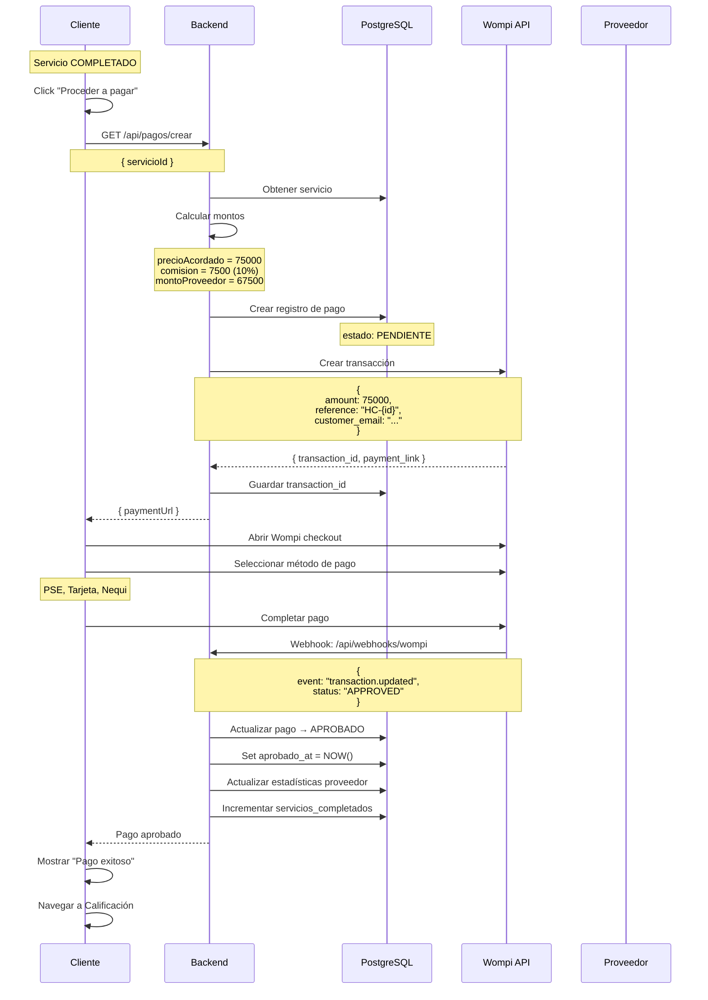

---

## FLUJO 10: Calificación Mutua

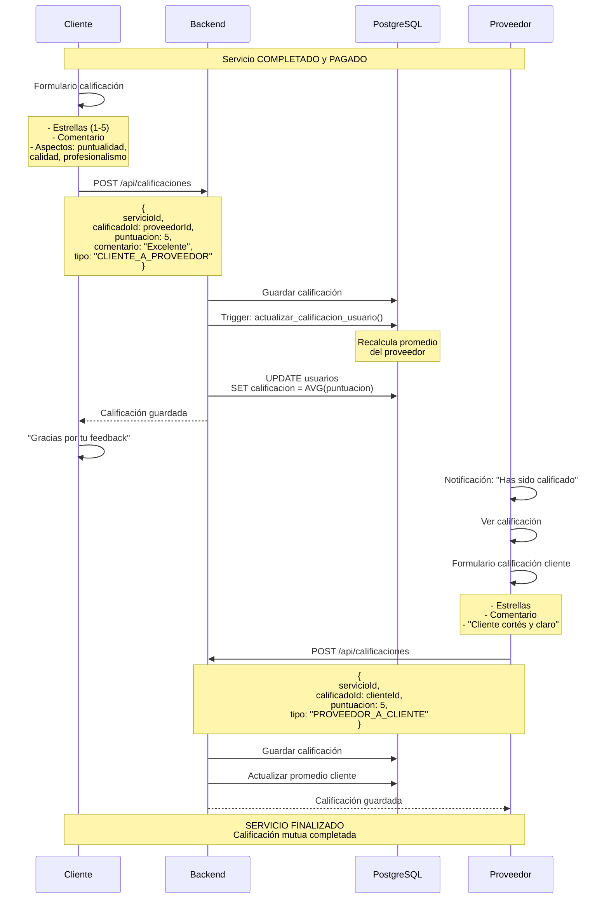

---

## FLUJO 11: Proveedor - Dashboard y Estadísticas

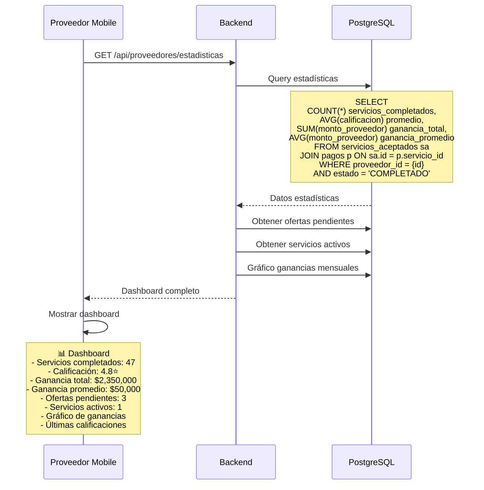

---

## FLUJO 12: Admin - Métricas del Sistema

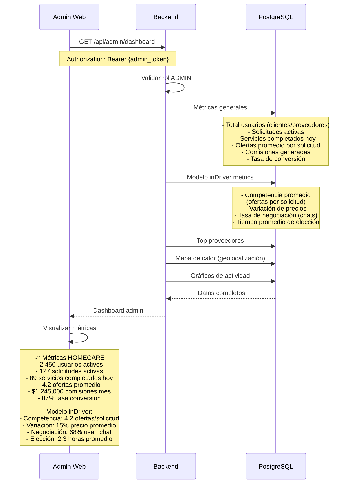

---

## VALIDACIÓN FINAL: Modelo inDriver

### ✅ Confirmación de Características

| Característica | Estado | Implementación |
|----------------|--------|----------------|
| Cliente publica solicitud | ✅ | POST /api/solicitudes |
| Proveedores compiten | ✅ | Múltiples POST /api/ofertas |
| Proveedor define SU precio | ✅ | Campo `precioOfrecido` libre |
| Ofertas privadas | ✅ | Solo cliente ve todas |
| Proveedores ven cantidad | ✅ | Campo `cantidadOfertas` |
| Cliente elige manualmente | ✅ | GET /api/ofertas + botón Aceptar |
| Negociación por chat | ✅ | WebSocket + mensajes |
| NO asignación automática | ✅ | Sin algoritmo de matching |
| NO precios fijos | ✅ | Proveedor propone libremente |

### 🎯 Diferencias vs Uber/Rappi

| Aspecto | HOMECARE (inDriver) | Uber/Rappi |
|---------|---------------------|------------|
| Precio | Proveedor lo define | App lo calcula |
| Asignación | Cliente elige | Automática |
| Ofertas | Múltiples visibles | Una invisible |
| Negociación | Sí, por chat | No |
| Competencia | Explícita | Implícita |
| Control | Cliente total | Algoritmo |

---

**🏠 HOMECARE - Modelo inDriver Validado ✅**

*Mercado libre • Competencia transparente • Elección del usuario*
