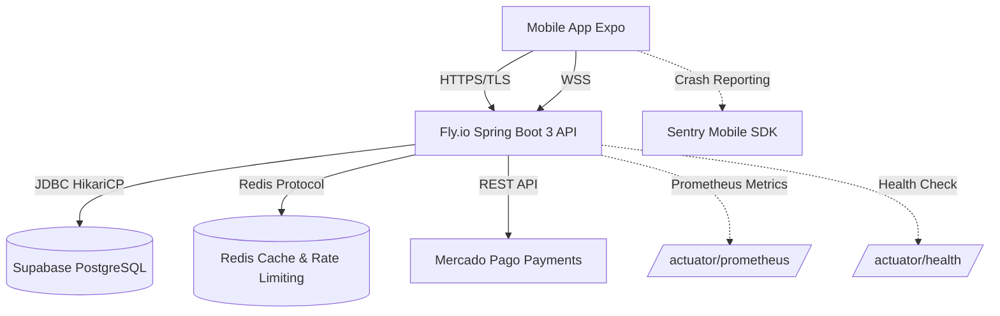

# Runbook de Monitoreo y Operaciones en Producción
**Proyecto**: Home Care Marketplace  
**Documento**: `tests/MONITORING_PRODUCTION_RUNBOOK.md`  
**Objetivo**: Protocolos operativos de observabilidad, salud de servicios, alertas y respuesta a incidentes en producción.

---

## 📈 1. Arquitectura de Observabilidad



---

## 🩺 2. Endpoints de Salud (Spring Boot Actuator)

El backend expone endpoints de diagnóstico accesibles para health checks de balanceadores:

| Endpoint | Propósito | Frecuencia de Poll | Respuesta Saludable |
|---|---|---|---|
| `GET /actuator/health/liveness` | Verifica si el proceso JVM está vivo | Cada 10s | `{"status":"UP"}` (HTTP 200) |
| `GET /actuator/health/readiness` | Verifica conectividad con DB PostgreSQL y Mail | Cada 15s | `{"status":"UP"}` (HTTP 200) |
| `GET /actuator/metrics/jvm.memory.used` | Consumo de memoria heap | En alertas | Métrica en bytes |
| `GET /actuator/metrics/hikaricp.connections.active` | Conexiones DB ocupadas | En alertas | Conteo activo < 8 |

---

## 🛠️ 3. Comandos Esenciales de Operaciones en Fly.io

```bash
# 1. Monitoreo de logs en tiempo real (Live Tail)
fly logs --app homecare-backend

# 2. Filtrar logs específicos de pagos o webhooks
fly logs --app homecare-backend | grep -i "mercadopago"

# 3. Filtrar errores no controlados (HTTP 500)
fly logs --app homecare-backend | grep -i "ERROR"

# 4. Estado de las máquinas virtuales y consumo de RAM
fly status --app homecare-backend

# 5. Reinicio graceful de instancias sin downtime
fly apps restart homecare-backend

# 6. Escalar memoria a 1GB en picos de alta demanda
fly scale memory 1024 --app homecare-backend
```

---

## 🚨 4. Matriz de Severidad de Incidentes y Protocolo de Respuesta

### Severidad P0 (Crítica - Interrupción de Ingresos o Servicio Total)
- **Definición**: Caída de pasarela de pagos, error 500 en todas las peticiones, o base de datos inalcanzable.
- **SLO de Respuesta**: < 15 minutos.
- **Acciones Inmediatas**:
  1. Verificar estado de Fly.io: `fly status --app homecare-backend`.
  2. Probar conectividad con Supabase: `curl https://homecare-backend.fly.dev/actuator/health`.
  3. Si HikariCP está agotado: reiniciar máquinas (`fly apps restart homecare-backend`).
  4. Revisar estado de la red de Mercado Pago en: [status.mercadopago.com](https://status.mercadopago.com).

### Severidad P1 (Alta - Degradación Parcial de Funcionalidad)
- **Definición**: Desconexión de WebSockets (chat inactivo), o retraso de más de 3 segundos en búsqueda de servicios.
- **SLO de Respuesta**: < 1 hora.
- **Acciones Inmediatas**:
  1. Comprobar conexiones Redis para el broker STOMP.
  2. Verificar slow query logs en Supabase Dashboard.
  3. Validar tasa de Rate Limiting (`grep "429 Too Many Requests"`).

### Severidad P2 (Media - Fallo Aislado de Usuario)
- **Definición**: Error en carga de foto de evidencia individual o fallo de notificación push a un token FCM específico.
- **SLO de Respuesta**: < 4 horas.
- **Acciones Inmediatas**:
  1. Consultar evento de error en Sentry Dashboard.
  2. Validar expiración de token de usuario o cuota de Supabase Storage.

---

## 🔄 5. Verificación de Webhooks de Mercado Pago

En la consola de Mercado Pago Developers:
1. Ir a **Notificaciones Webhook** ➔ Historial de eventos.
2. Comprobar que los eventos hacia `https://homecare-backend.fly.dev/api/pagos/webhook/mercadopago` muestran status `200 OK`.
3. Si un webhook falla, Mercado Pago reintenta con backoff exponencial durante 24 horas. El backend absorberá los reintentos de forma 100% idempotente.
